# AnixOps-ansible

> 注意：本仓库仅支持 Linux/Mac 作为 Ansible 控制节点（Linux-only）。不再提供任何 Windows/WSL 启动脚本或指南。

<div align="center">


**基于 GitOps 理念的全球分布式服务器自动化运维平台**

[快速开始](#-快速开始) • [项目结构](#-项目结构) • [工作流](#-工作流程) • [文档](#-完整文档)

</div>

---

## 📖 项目概述

AnixOps-ansible 是一个完整的 GitOps 基础设施即代码（Infrastructure as Code）解决方案，用于管理全球分布式服务器集群。

### 核心特性

- 🔐 **GitOps 工作流**：所有变更通过 Git 管理，完全可审计
- 🤖 **自动化部署**：GitHub Actions 自动执行配置变更
- 📊 **可观测性**：集成 Prometheus + Loki + Grafana (PLG) 栈
- 🔒 **安全加固**：SSH 密钥管理、防火墙、Fail2Ban
- 🌍 **全球分布式**：支持多区域服务器管理
- 📦 **模块化设计**：可复用的 Ansible Roles

---

## 📁 项目结构

```
AnixOps-ansible/
├── .github/
│   └── workflows/              # CI/CD 工作流
│       ├── lint.yml           # 代码检查
│       └── deploy.yml         # 自动部署
│
├── inventory/
│   ├── hosts.yml              # 主机清单（支持环境变量）
│   └── group_vars/
│       └── all/
│           └── main.yml       # 全局变量配置
│
├── roles/                      # Ansible 角色
│   ├── common/                # 基础配置（安全、时区、用户）
│   ├── nginx/                 # Web 服务器
│   ├── node_exporter/         # Prometheus 监控
│   └── promtail/              # Loki 日志收集
│
├── playbooks/                  # Playbook 文件
│   ├── site.yml              # 完整部署
│   ├── quick-setup.yml       # 快速初始化
│   ├── web-servers.yml       # Web 服务器部署
│   └── health-check.yml      # 健康检查
│
├── observability/              # 可观测性配置
│   ├── prometheus/
│   │   └── rules/            # 告警规则
│   └── grafana/
│       └── dashboards/       # Grafana 仪表盘
│
├── tools/
│   ├── ssh_key_manager.py    # SSH 密钥管理工具
│   ├── secrets_uploader.py   # 🆕 GitHub Secrets 批量上传工具
│   └── cloudflare_manager.py # Cloudflare DNS 管理工具
│
├── ansible.cfg                # Ansible 配置
├── requirements.txt           # Python 依赖
└── README.md                  # 本文件
```

---

## 🚀 快速开始

### 前置要求

- Python 3.8+
- Ansible 2.15+
- Git
- GitHub 账户（用于 GitHub Actions）

### 1. 克隆项目

```bash
git clone https://github.com/AnixOps/AnixOps-ansible.git
cd AnixOps-ansible
```

### 2. 配置服务器 IP (.env 文件)

复制环境变量模板并填入真实 IP：

```bash
cp .env.example .env
# 编辑 .env 文件，填入你的服务器 IP
vim .env
```

**.env 示例配置：**

```bash
# 点对点连接 (/31 或 /127) - 直接连接
US_W_1_V4=203.0.113.10/31        # 直接SSH到这个IP
US_W_1_V6=2001:db8::1/127

# 内网段 - 需要SSH_IP (公网IP或网关)
JP_1_V4=10.10.0.50/27            # 内网IP，用于配置管理
JP_1_V6=2001:19f0:5001::1/120
JP_1_SSH_IP=45.76.123.45         # SSH连接到这个公网IP

# SSH 配置
ANSIBLE_USER=root
SSH_KEY_PATH=~/.ssh/id_rsa
```

**连接逻辑：**
- **`/31` (IPv4) 或 `/127` (IPv6) 段**：点对点连接，直接使用该IP
  - 示例：`203.0.113.10/31` → 直接 SSH 到 `203.0.113.10`
- **其他网段**：必须设置 `_SSH_IP` 变量指定SSH连接地址
  - 示例：`JP_1_V4=10.10.0.50/27` + `JP_1_SSH_IP=45.76.123.45`
  - SSH 连接到 `45.76.123.45`，内网IP用于配置管理

### 3. 安装依赖（推荐：使用启动脚本创建虚拟环境）

```bash
# 一次性创建并激活虚拟环境、安装依赖
./scripts/anixops.sh setup-venv
```

### 3. SSH 密钥管理

#### 方式一：本地使用（推荐新手）

生成 SSH 密钥并复制到服务器：

```bash
# 生成密钥
ssh-keygen -t rsa -b 4096 -C "ansible@anixops" -f ~/.ssh/id_rsa

# 复制公钥到所有服务器（根据 .env 中的 IP）
ssh-copy-id -i ~/.ssh/id_rsa.pub root@YOUR_SERVER_IP
```

#### 方式二：GitHub Actions 自动部署

使用工具安全地将 SSH 私钥上传到 GitHub Secrets：

```bash
python tools/ssh_key_manager.py
```

交互式程序会引导你完成以下步骤：
1. 输入本地 SSH 私钥路径（默认：`~/.ssh/id_rsa`）
2. 输入 GitHub 仓库（格式：`owner/repo`）
3. 输入 GitHub Personal Access Token（需要 `repo` 权限）
4. 输入 Secret 名称（默认：`SSH_PRIVATE_KEY`）

**或者使用命令行参数：**

```bash
python tools/ssh_key_manager.py \
  --key-file ~/.ssh/id_rsa \
  --repo AnixOps/AnixOps-ansible \
  --token ghp_your_token_here \
  --secret-name SSH_PRIVATE_KEY
```

### 4. 配置 GitHub Secrets（可选，用于 CI/CD）

如果使用 GitHub Actions 自动部署，需要配置 GitHub Secrets。

#### 🆕 方式一：批量上传工具（推荐）

使用新增的 `secrets_uploader.py` 工具，一键从 `.env` 批量上传所有 Secrets：

```bash
# 交互式模式
python tools/secrets_uploader.py

# 或命令行模式
python tools/secrets_uploader.py \
  --repo AnixOps/AnixOps-ansible \
  --token ghp_your_token_here \
  --yes
```

**功能特性**：
- ✅ 一次性上传所有环境变量
- ✅ 自动加密安全传输
- ✅ 支持过滤和排除变量
- ✅ 实时进度显示
- ✅ 详细错误提示

详细使用说明：[Secrets Uploader 文档](tools/README_SECRETS_UPLOADER.md)

#### 方式二：手动配置（传统方式）

在仓库 Settings → Secrets → Actions 中手动配置：

| Secret 名称 | 说明 | 示例 |
|------------|------|------|
| `SSH_PRIVATE_KEY` | SSH 私钥 | 通过 ssh_key_manager.py 上传 |
| `ANSIBLE_USER` | SSH 用户名 | `root` 或 `ubuntu` |
| `ANSIBLE_PORT` | SSH 端口 | `22` |
| `US_W_1_V4` | 美西服务器1 IPv4 | `203.0.113.10/31` |
| `US_W_1_V6` | 美西服务器1 IPv6 | `2001:db8::1/127` |
| （其他变量） | 参考 `.env.example` | |
| `PROMETHEUS_URL` | Prometheus 地址（可选） | `http://prometheus.example.com:9090` |
| `LOKI_URL` | Loki 地址（可选） | `http://loki.example.com:3100` |

完整的 Secrets 配置参考：[GitHub Secrets 配置指南](docs/GITHUB_SECRETS_REFERENCE.md)

### 5. 测试连接

```bash
./scripts/anixops.sh ping
```

### 6. 执行部署

#### 本地执行 (Linux/Mac)

```bash
# 完整部署
./scripts/anixops.sh deploy

# 快速初始化（包含基础配置、监控和防火墙）
./scripts/anixops.sh quick-setup

# 单独配置防火墙和监控白名单
./scripts/anixops.sh firewall-setup

# 健康检查
./scripts/anixops.sh health-check
```

**或使用 Makefile**:

```bash
make deploy              # 完整部署
make quick-setup        # 快速初始化（含监控和防火墙）
make firewall-setup     # 单独配置防火墙规则
make health-check       # 健康检查
```

**Quick Setup 包含的功能**：
- ✅ 基础系统配置（时区、软件包、SSH 加固）
- ✅ Prometheus Node Exporter（端口 9100）
- ✅ Promtail 日志收集（端口 9080）
- ✅ 防火墙白名单配置
  - 公开端口：22 (SSH), 80 (HTTP), 443 (HTTPS)
  - 受限端口：9100, 9080, 9090, 3100, 3000（仅白名单 IP 可访问）

<!-- 已移除 Windows 支持：本仓库为 Linux-only -->

#### 通过 GitHub Actions

1. 创建一个新分支：`git checkout -b feature/your-change`
2. 修改配置文件
3. 提交并推送：`git commit -am "feat: your change" && git push`
4. 创建 Pull Request
5. 合并到 `main` 分支后自动部署

---

## 🔄 工作流程

### 标准变更流程

```mermaid
graph LR
    A[创建功能分支] --> B[修改代码]
    B --> C[提交 & 推送]
    C --> D[创建 Pull Request]
    D --> E[CI: Lint & 检查]
    E --> F[代码审查]
    F --> G[合并到 main]
    G --> H[CD: 自动部署]
    H --> I[验证 Grafana]
```



### 紧急修复流程

```bash
# 1. 创建 hotfix 分支
git checkout -b hotfix/critical-fix

# 2. 快速修改并提交
git commit -am "hotfix: critical issue"

# 3. 推送并创建 PR
git push origin hotfix/critical-fix

# 4. 快速审核后立即合并
# 5. 在 Grafana 中验证修复
```

---

## 📊 可观测性

### Prometheus 监控

- **主机指标**：CPU、内存、磁盘、网络
- **应用指标**：Nginx 请求、状态码、延迟
- **告警规则**：在 `observability/prometheus/rules/` 中定义

### Loki 日志

- **系统日志**：syslog、auth.log
- **应用日志**：Nginx access.log、error.log
- **关联查询**：与 Prometheus 指标一键关联

### Grafana 仪表盘

- **Node Exporter Dashboard**：主机性能监控
- **Nginx Dashboard**：Web 服务器监控
- **自定义仪表盘**：在 `observability/grafana/dashboards/` 中定义

---

## 🔒 安全最佳实践

1. ✅ **SSH 密钥通过 ssh_key_manager.py 加密上传**
2. ✅ **敏感信息存储在 GitHub Secrets 中**
3. ✅ **所有服务器启用防火墙 + Fail2Ban**
4. ✅ **SSH 禁用密码登录，仅允许密钥认证**
5. ✅ **定期审计 Git 提交历史**
6. ⚠️ **永远不要将私钥或密码提交到 Git**

---

## 📚 完整文档

### 核心文档

- 📖 **[快速开始指南](docs/QUICKSTART.md)** - 5 分钟快速部署
- 🔧 **[GitHub Actions 配置](docs/GITHUB_ACTIONS_SETUP.md)** - CI/CD 自动部署设置
- � **[GitHub Secrets 配置参考](docs/GITHUB_SECRETS_REFERENCE.md)** - 完整的环境变量和 Secrets 配置指南
- �📊 **[可观测性部署指南](docs/OBSERVABILITY_SETUP.md)** - Prometheus + Loki + Grafana 完整部署
- 🏷️ **[服务器别名管理](docs/SERVER_ALIASES.md)** - 统一管理服务器标签和别名
- 📝 **[使用示例](docs/EXAMPLES.md)** - 10 个实际场景示例
- 🔐 **[SSH 密钥管理方案](docs/SSH_KEY_MANAGEMENT.md)** - 多机器私钥管理完整方案
- 🖥️ **[多机器操作指南](docs/MULTI_MACHINE_SETUP.md)** - Linux/Mac 多平台配置
- 📋 **[项目总结](docs/PROJECT_SUMMARY.md)** - 完整功能清单
- 🚀 **[版本发布指南](docs/RELEASE_GUIDE.md)** - 版本发布流程和检查清单
- 📜 **[更新日志](CHANGELOG.md)** - 版本历史

### 命令参考

- **Linux/Mac**: 使用 `Makefile` - 运行 `make help` 查看所有命令

---

## 🤝 贡献指南

1. Fork 本仓库
2. 创建功能分支：`git checkout -b feature/amazing-feature`
3. 提交变更：`git commit -m 'feat: Add amazing feature'`
4. 推送到分支：`git push origin feature/amazing-feature`
5. 创建 Pull Request

---

## 📄 许可证

本项目采用 MIT 许可证。详见 [LICENSE](LICENSE) 文件。

---

## 👥 联系方式

- 项目维护者：@kalijerry
- 项目主页：[https://github.com/AnixOps/AnixOps-ansible](https://github.com/AnixOps/AnixOps-ansible)
- 问题反馈：[Issues](https://github.com/AnixOps/AnixOps-ansible/issues)

---

<div align="center">

**⭐ 如果这个项目对你有帮助，请给一个 Star！⭐**

Made with ❤️ by AnixOps Team

</div>
        jumphost-01:
          ansible_host: 您的跳板机IP
```

### 4. 测试连接

```bash
# 测试所有主机连接
ansible all -m ping

# 检查 Playbook 语法
ansible-playbook --syntax-check playbooks/site.yml
```

### 5. 运行 Playbook

```bash
# 试运行（不实际执行）
ansible-playbook playbooks/site.yml --check

# 正式运行
ansible-playbook playbooks/site.yml
```

## 主要功能

- 🔧 **服务器初始化**: 自动配置时区、软件包、用户等基础设置
- 🔒 **安全加固**: SSH 配置、防火墙规则、用户权限管理
- 📊 **监控部署**: 自动部署监控代理和配置
- 🚀 **应用部署**: 支持多种应用的自动化部署
- 🔄 **CI/CD 集成**: 通过 GitHub Actions 实现自动化测试和部署

## 开发指南

### 创建新角色

```bash
# 在 roles/ 目录下创建新角色
ansible-galaxy init roles/your-role-name
```

### 使用 Ansible Vault

```bash
# 创建加密变量文件
ansible-vault create inventory/group_vars/all/vault.yml

# 编辑加密文件
ansible-vault edit inventory/group_vars/all/vault.yml
```

### 代码规范

- 所有 YAML 文件使用 2 空格缩进
- 变量名使用下划线命名法
- 添加适当的注释和文档
- 提交前运行 `ansible-lint` 检查

## 贡献指南

1. Fork 本项目
2. 创建功能分支 (`git checkout -b feature/amazing-feature`)
3. 提交更改 (`git commit -m 'Add some amazing feature'`)
4. 推送到分支 (`git push origin feature/amazing-feature`)
5. 开启 Pull Request

## 许可证

本项目采用 MIT 许可证 - 查看 [LICENSE](LICENSE) 文件了解详情。

## 联系我们

- 项目主页: https://github.com/AnixOps/AnixOps-ansible
- 问题反馈: https://github.com/AnixOps/AnixOps-ansible/issues" 
